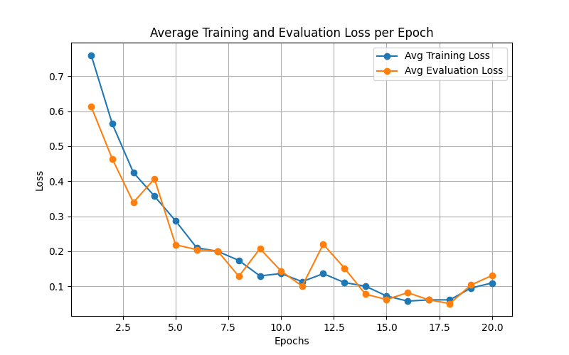
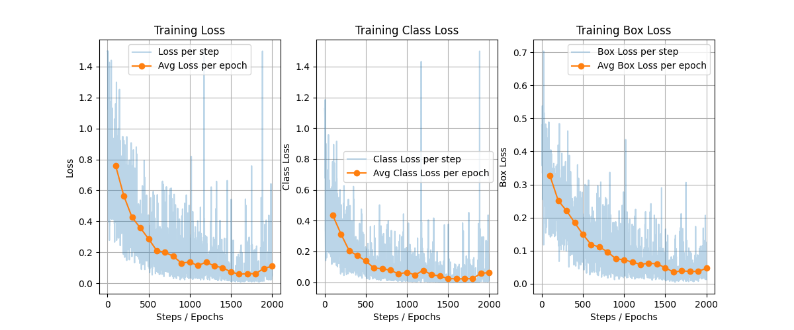
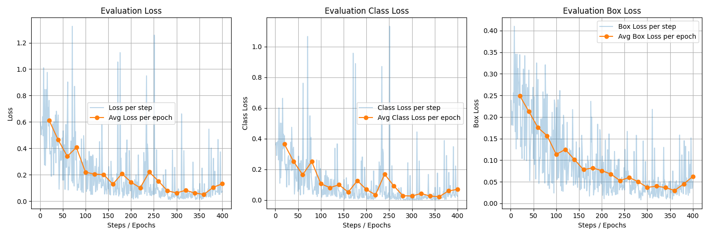

<div id="top"></div>

<h1 align="center">
    <a href="https://github.com/Armaggheddon/retinanet_demystified">A Clear and Simple RetinaNet in PyTorch</a>
</h1>
<p align="center">
    <a href="https://github.com/Armaggheddon/retinanet_demystified/commits/master">
    
    </a>
    <a href="https://github.com/Armaggheddon/retinanet_demystified">
    
    </a>
    <a href="https://github.com/Armaggheddon/retinanet_demystified/issues">
    
    </a>
    <a href="https://github.com/Armaggheddon/retinanet_demystified/blob/master/LICENSE">
    
    </a>
    <a target="_blank" href="https://colab.research.google.com/github/Armaggheddon/retinanet_demystified/blob/main/run_in_colab.ipynb">
    
    </a>

---


This project is a clean and commented PyTorch implementation of the paper [RetinaNet: Focal Loss for Dense Object Detection](https://arxiv.org/abs/1708.02002).

While many RetinaNet implementations exist, this one is built from the ground up with a specific goal: **to be a clear educational resource**. It follows the original paper as closely as possible, stripping away production-level optimizations and boilerplate. This allows you to focus on the core concepts of RetinaNet without getting lost in the weeds.

It's perfect for anyone looking to understand how RetinaNet *really* works under the hood.

## Key Features

*   **Paper-Focused:** The implementation sticks closely to the concepts described in the original paper.
*   **Deeply Commented:** Code blocks are linked back to the specific sections of the paper they implement. This makes it easy to cross-reference and understand the "why" behind the code.
*   **Multiple Backbones:** Supports ResNet-18, ResNet-34, ResNet-50, ResNet-101, and ResNet-152 backbones right out of the box.
*   **Simplicity by Design:** Intentionally omits features like custom `BatchNorm` layers in the heads to keep the focus on the fundamental architecture.

## Quick Start: Training on Raccoons 🦝

Let's get this model trained! We'll use the fun [Raccoon dataset](https://github.com/datitran/raccoon_dataset) to prove that our implementation, despite its simplicity, can learn to detect objects.

1.  **Clone the repository:**
    ```bash
    git clone <your-repo-url>
    cd retinanet_pytorch
    ```

2.  **Download the dataset:**
    ```bash
    git clone https://github.com/datitran/raccoon_dataset
    ```

3.  **Set up your environment (Recommended):**
    ```bash
    python -m venv .venv
    source .venv/bin/activate  # On Windows use `.venv\Scripts\activate`
    pip install -r requirements.txt
    ```

4.  **Start Training:**
    Feel free to peek into `train.py` and tweak the `HYPERPARAMETERS`!
    ```bash
    python train.py
    ```
    After training, your model weights will be saved as `retinanet_raccoon_rnXX.pth`.

5.  **Run Inference:**
    Modify the `IMAGE_PATH` in `load_trained.py` to point to a test image.
    ```bash
    python load_trained.py
    ```
    Check out the `output.png` file to see your model in action!

## Proof of Life: Does it Learn?

Absolutely! The goal here isn't to set new state-of-the-art records, but to demonstrate that the core architecture works and learns. The plots below show a ResNet18 backbone trained for 20 epochs on the small Raccoon dataset.

You'll notice clear signs of overfitting, which is expected given the dataset's size. But more importantly, you'll see the loss decreasing and the model successfully identifying objects. It's alive!

<p align="center">
    
    <br><em>Average training and evaluation loss per epoch. The model is learning!</em>
</p>
<p align="center">
  
  <br><em>Training total loss, classification loss, and box regression loss.</em>
</p>
<p align="center">
  
  <br><em>Evaluation total loss, classification loss, and box regression loss.</em>
</p>

## Paper References

The papers referenced throughout the code are:
*   [RetinaNet: Focal Loss for Dense Object Detection](https://arxiv.org/abs/1708.02002) - Lin et al., 2017
*  [Fast R-CNN](https://arxiv.org/abs/1504.08083) - Ross Girshick, 2015
*  [Feature Pyramid Networks for Object Detection](https://arxiv.org/abs/1612.03144) - Lin et al., 2017
* [Faster R-CNN: Towards Real-Time Object
Detection with Region Proposal Networks](https://arxiv.org/abs/1506.01497) - Shaoqing Ren, Kaiming He, Ross Girshick, and Jian Sun, 2015
* [Deep Residual Learning for Image Recognition](https://arxiv.org/abs/1512.03385) - Kaiming He, Xiangyu Zhang, Shaoqing Ren, and Jian Sun, 2015

> [!TIP] 
> When no paper reference is given it is always referred to the main RetinaNet paper.

## Did I miss something? 😅

Feel free to open an issue or submit a pull request. Contributions are welcome! Just remember, the goal is to keep things simple and educational.
